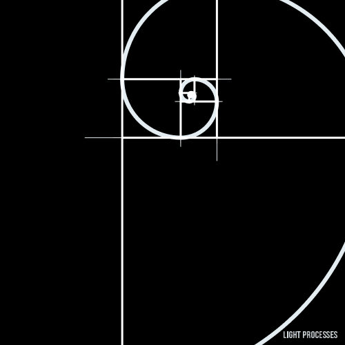

In mathematics, the Fibonacci numbers are the numbers in the following integer sequence, called the Fibonacci sequence, and characterized by the fact that every number after the first two is the sum of the two preceding ones:

> 1, 1, 2, 3, 5, 8, 13, 21, 34, 55, 89, 144, ...

The Fibonacci numbers occur in the sums of "shallow" diagonals in Pascal's triangle:

The fibbonacci can be represent by such spiral

